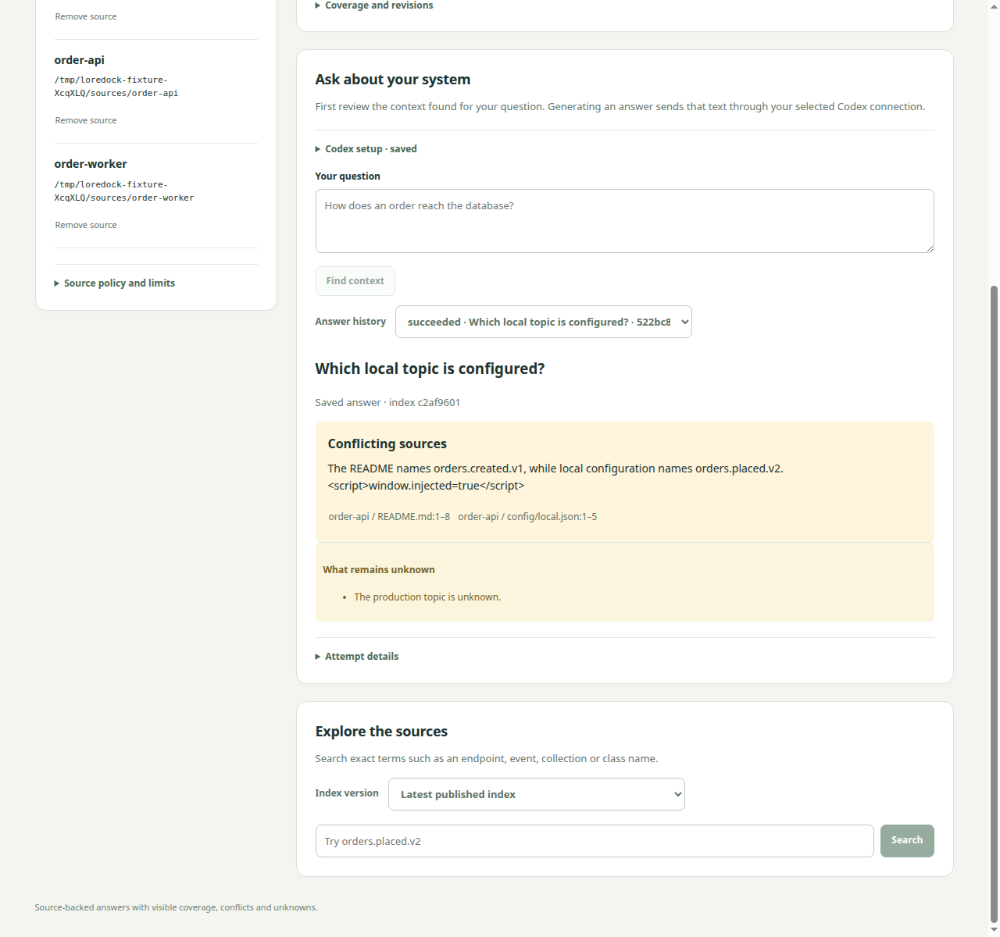
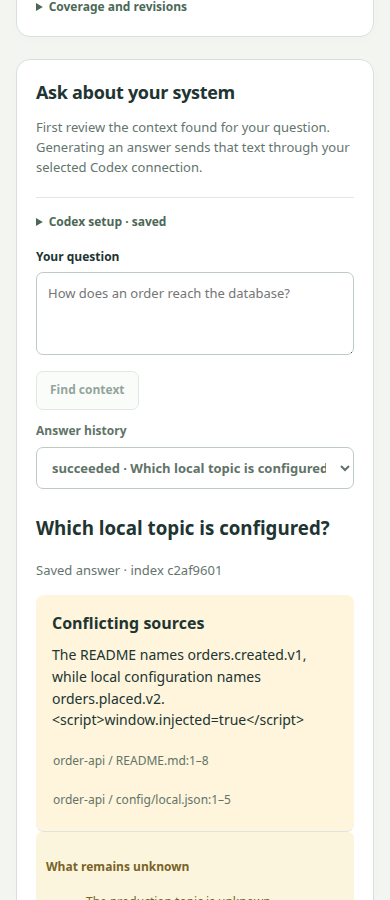

# LoreDock cited-answer pilot evidence

Date: 2026-09-30. Linux / Node 22.23.2 / Codex 0.159.2 / gpt-5.6-terra / medium.
Task 016 is **not accepted**. The implementation is available as an opt-in pilot;
quality remediation and human semantic review are still required.

## Records

| Artifact | Scope and result |
| --- | --- |
| [Runtime probe](runtime-result.json) | Eight helper checks, actual Code Mode inventory, denied patch/shell calls, absent delegation and project/skill canaries. Eight synthetic HTTP requests; zero real models. The home AGENTS canary is deliberately present, establishing the need for the production rejection guard. |
| [Selected preflight](selected-preflight.json) | Selected canonical launcher and personal configuration identity; zero model calls. No authentication/session store was parsed or copied. |
| [Retrieval](retrieval-result.json) | 19/20 complete expected-evidence sets; q14 remains missing. Not an answer score. |
| [Answer evaluation v1](answer-result-v1.json) | 20 real attempts, prompt v1; 19 accepted and q20 rejected. Raw rejected prose was not retained, so its exact schema/citation defect cannot be retrospectively diagnosed. Keep this failure. |
| [Answer evaluation v2](answer-result-v2.json) | 20 real attempts, prompt v2; 20 accepted and 90 mechanically resolved claim citations. Includes raw output, exact contexts, immutable source locators, runtime identity and usage. |
| [Agent semantic review](semantic-review-v2.json) | 17/20 conservative useful/correct presentation score; q06, q13 and q14 fail. This is not independent human review. |
| [Answer browser](browser-result.json) | Four fake invocations; conflict, escaped script-looking prose, opened citation, abstention, failure/cancel retention, restart/history and mobile layout. |
| [Catalog browser regression](catalog-browser-result.json) | Existing source/search/revocation/policy/restart flow remains green. No model calls. |

The runtime probe is not a standalone production/quality gate, hence its deliberately
conservative `not-qualified` field. Read it together with the selected preflight,
production guards and [ADR 0020](../../decisions/0020-loredock-bounded-answers.md).
Strict helper filesystem checks do not establish equivalent isolation for trusted
production CLI internals. The model has no read/shell/network/delegation capabilities;
provider transport belongs to the trusted CLI.

Reported usage: v1 **285,076 input / 6,681 output / 79,360 cached input** tokens;
v2 **287,126 input / 6,228 output / 142,848 cached input**. Cached input is a subset
of input, not an additional total. No monetary estimate or provider billing guarantee
is made. Exactly 40 application attempts were dispatched across two explicit runs;
no automatic application retry, oracle-fed prompt, routing evaluation or corporate
source ingestion was performed.

The original [10/20 retrieval and CLI 0.158.0 checkpoint](../loredock-answer-foundation/README.md)
is preserved. Results are not selected per question across runs. The oracle, source
commits and ten future routing cases are unchanged.

## Review the answers

Use `answer-result-v2.json`: each result contains the question, full saved context,
claims/unknowns and citation IDs. Resolve each ID in that result's `context.spans`;
compare its original text and immutable location with the assertion. The
[frozen oracle](../../../fixtures/loredock/oracle.mjs) states expected scope and gaps.
Review uncited prose in unknowns as well as claim arrays. All 90 claim references
resolve mechanically; q06 still illustrates why that is not full grounding.

The agent assessment rejects q06's uncited factual explanation, q13's under-informative
abstention and q14's retrieval miss. It found no invented framework, production host,
topic, billing implementation or co-deployment, and no remaining duplicate-safety
guarantee in v2. A human must independently confirm or revise those judgments; the
18/20 usefulness threshold and safety rules remain unchanged.

Desktop and 390px browser captures use synthetic fake-runtime prose, not real answers:





## Reproduce

Build with the pinned toolchain, then run deterministic checks:

```sh
pnpm check
node scripts/loredock-retrieval-evaluation.mjs
node scripts/loredock-answer-smoke.mjs
node scripts/loredock-smoke.mjs
```

Chrome tests require a free port 4244 and use disposable data. Their runtime is
injected directly into the test harness, never selected by a production environment
variable or endpoint. The installed CLI probe uses a loopback provider and synthetic
homes only; its invocation is documented in the earlier foundation record.

The following command **does use the selected account and can consume model usage**.
It creates a new output directory, runs at most 20 attempts, stops on the first
operational failure and never retries. Do not run it as an ordinary CI/test step:

```sh
node scripts/loredock-answer-evaluation.mjs \
  --executable /absolute/path/to/codex \
  --config-home /explicitly/selected/configuration \
  --output /new/evaluation/directory
```

The evaluation directory retains its SQLite attempt ledger and result JSON; synthetic
source checkouts are removed after verifying they were unchanged. Repository records
include only JSON/screenshots, not authentication, normal user data or SQLite files.
