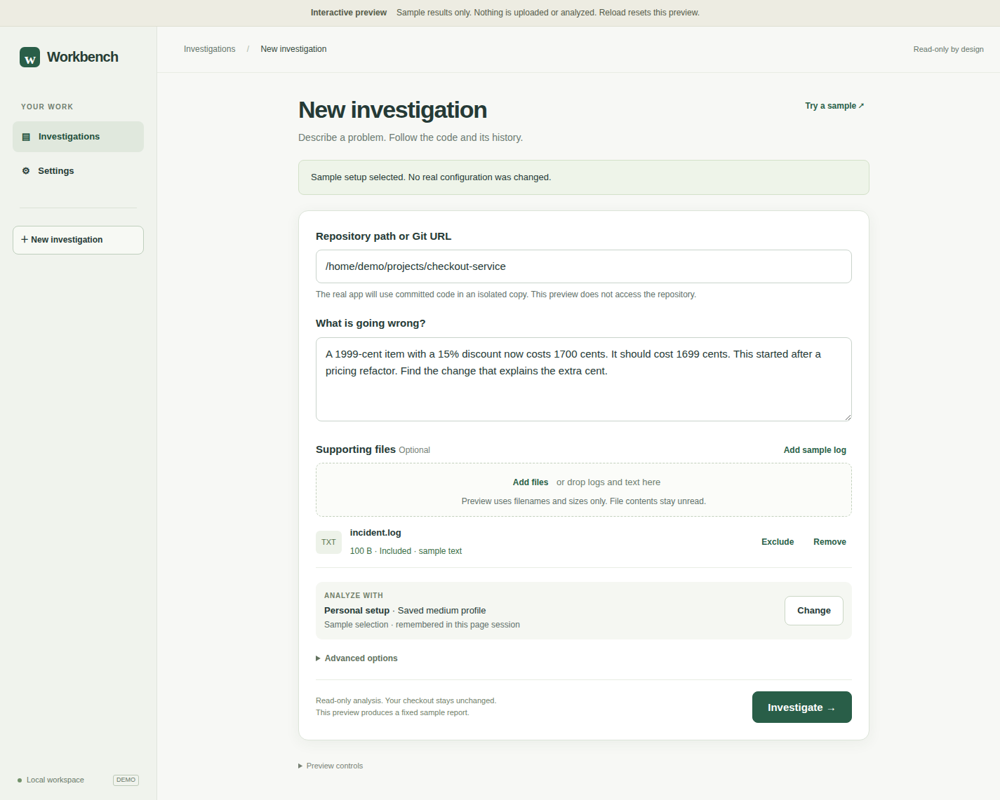
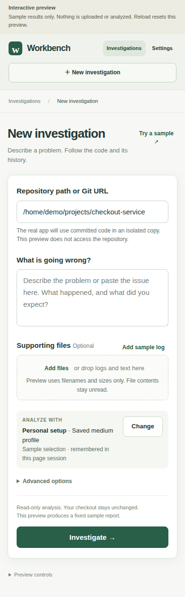

# UX prototype verification

Recorded on 2026-09-28 using `node scripts/prototype-smoke.mjs`, Node 22.23.2 and
an isolated headless Chrome profile. [Results](browser-result.json) cover the
scripted interaction checks; the owner's unassisted walkthrough remains pending.

The screenshots show sample data only. They do not show a production investigation.

## Desktop composer

## Narrow composer

Reproduce or try the prototype using its [README](../../../prototypes/investigation/README.md).
