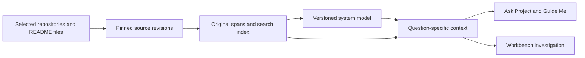

# LoreDock first, Workbench second

Status: L0 and L1 merged through PR #18; L2 in progress, 2026-09-30.
The [L2 answer checkpoint](ANSWER_FOUNDATION.md) records the opt-in answer workflow,
runtime qualification, browser checks and frozen-question evaluations. Human semantic
acceptance is still required; relationships and the Workbench bridge remain planned.
See [L0 measurements and blockers](FEASIBILITY.md), [contracts](CONTRACTS.md),
[Task 015](../../tasks/015-loredock-source-catalog.md) and
[Task 016](../../tasks/016-loredock-cited-answer.md) for the next bounded slices.

## Outcome and delivery boundary

Build a durable, source-backed understanding of a system spanning approximately
20 repositories and its documentation. Use that understanding to answer questions
and locate relevant components before Workbench investigates a defect. Later,
Workbench should accept a problem description without requiring repository selection.

Preserve the working Workbench baseline. Its investigation, evidence, revisions,
export and simplified UI remain useful. Pause feature expansion beyond necessary
maintenance. Do not implement LoreDock as additional fields in the investigation
composer or require every knowledge build to create an artificial Workbench task.

The input is `LoreDock_TZ_v0.1_draft.md`, dated 2026-09-10, supplied in the workspace
root. [The specification review](REVIEW.md) records provenance, retained requirements,
changes to the draft's order and concrete reuse limitations in the current code.
All application output, documentation, examples and generated artifacts remain English.
Users may ask questions in other languages; retrieval must account for that.

## What “system context” means

Maintain three complementary layers:

1. **Source catalog and evidence:** explicitly selected repositories/documents,
   immutable revisions, searchable original text, extraction status and locators.
2. **System model:** repository responsibilities, services/modules, domains,
   interfaces, message contracts, data stores, deployment relationships and business
   flows. Claims and relationships retain source evidence, scope and uncertainty.
3. **Question-specific context:** a bounded selection of original spans and relevant
   relationships, retrieved from the whole authorized system for a question or defect.

All registered repositories participate in inventory and baseline orientation before
claiming that the system has been mapped. Deeper analysis is selective and resumable.
A repository with no supported extraction remains a visible gap; listing it does not
count as understanding it. Source coverage, semantic analysis and human review are
separate measurements. Never claim that every line was understood or that all
corporate systems have been discovered.

A broad project model is built before defect diagnosis. Each investigation then
reopens relevant source/history and can broaden its search. A summary is a navigation
aid; it is not a replacement for the underlying evidence.

## Product experience

The normal first-use path is **Create project → Add repositories and documents →
Review scope and setup → Build project knowledge**. Support bulk registration from
an explicit list of local paths/Git URLs and preview the resulting sources. Reusing
an approved manifest avoids entering 20 repositories one by one. Do not scan an
entire disk, organization or wiki implicitly.

The resulting project home has **Overview**, **System map**, **Ask Project** and
**Sources & gaps**. These are views of one project, not independent setup forms.
Offer a small **Guide Me** route through the overview and one business flow.
Keep parser options, fingerprints and job diagnostics under details.

Returning users choose a project and ask a question. An explicit **Update knowledge**
shows changed sources, reuses valid work and preserves the previous published build.
After Workbench integration, **Investigate a problem** uses that same project context;
the system explains its selected repositories, with an optional override.

## Implementation home and reuse

Recommended starting point: a separately runnable LoreDock application in the
existing repository. This permits audited reuse and one development workflow while
leaving the Workbench application and data untouched. A new hosted repository,
product rename, public package or shared platform is not a prerequisite.

Proposed boundaries, to settle in L0:

- Separate LoreDock daemon/UI entry points, application-data root, SQLite database,
  migrations and ownership lock. No direct reads or joins against Workbench's DB.
- Reuse the tested Git/process utilities and selected UI/HTTP protection patterns.
  Add only the source-reading capabilities the vertical slice needs.
- Extract a narrow runtime execution contract only where required. The existing
  `AIRunRequest` imports Workbench's `RunInputSnapshot`; `RuntimeService` assumes tasks,
  worktrees and investigation results. They are not ready-made knowledge-build APIs.
  Preserve existing callers/tests through an adapter; do not generalize their state machine.
- Keep LoreDock entities and job persistence separate. Knowledge builds contain
  bounded work units; they are not one large Workbench investigation invocation.
- Share code, not mutable source ownership. Each application owns its pins/snapshots.
  Merely having separate daemons does not coordinate Git mutations or AI concurrency:
  use independent managed object stores for LoreDock initially, and avoid overlapping
  paid builds/investigations in the pilot. Validate any later shared lock mechanism.
- One AI worker per LoreDock daemon initially. Bounded deterministic extraction can
  be parallelized after measurement. No distributed queue or multi-agent platform.

The first implementation must not rewrite Workbench migrations or move existing
user data. If independent distribution becomes useful, splitting the repository
remains possible through the context-exchange boundary.

## Sources, snapshots and the system model

### Source collection

Start with committed Git content, UTF-8 Markdown/TXT and selected text manifests.
Add sanitized local HTML exports only when a selected document requires them. Preserve
origin, original hash and extraction-to-original mapping. Imported context is not
limited to the current Workbench composer's 1 MiB draft budget; LoreDock needs its
own per-file, per-project and per-run limits plus streaming/chunked processing.

Document business intent, terminology and external systems as well as code. Allow a
short engineer-supplied project brief and optional annotations, labeled as human
claims. Do not make the user manually draw a complete architecture before the tool
can start. Unsupported PDF/slide content remains a gap; promote one such format only
if the pilot cannot answer essential questions without it.

Read Git objects at recorded revisions. Git provides object-content access through
[`git cat-file`](https://git-scm.com/docs/git-cat-file); raw object extraction avoids
requiring a checkout for every ingestion step. Use bounded process output and safe
path/object parsing; do not enable filters/text conversion or execute project commands.
Record submodules, LFS pointers, generated code, vendored trees, binaries, missing
objects and unreadable sources explicitly. Never silently follow or download them.

A project snapshot is a **revision vector**, one commit/document revision per source.
Capturing 20 default branches does not establish a coherent production deployment.
Record collection times and declared environment. If release/deployment manifests
exist, use them to identify compatible versions; otherwise mark deployment coherence
unknown. Preserve that distinction in answers and later Workbench context.

### First adapters for the confirmed stack

Documentation is mainly README files. The first useful build must connect those
explanations to implementation evidence rather than wait for a separate architecture wiki.
Do a broad first pass over every repository's README, build/package manifest, entry
points and relevant configuration before spending the budget on deep module analysis.

| Source family | First useful extraction | Limit to preserve |
| --- | --- | --- |
| README / Markdown | Product purpose, repository role, setup notes, terms, named integrations and documented decisions, with original spans. | Instructions can be stale; documented intent is not observed deployment behavior. |
| Java | Packages/modules, build dependencies, entry points, HTTP handlers/clients, message adapters and persistence code in the detected framework. | Determine the actual build/framework conventions in L0; do not assume Spring or that static analysis resolves reflection/generated code. |
| JavaScript / TypeScript | Imports/exports, package/workspace structure, request wrappers, API clients and configuration references. | Computed endpoints or module names remain unresolved until supported by configuration evidence. |
| Vue | Components, routes, state/store interactions and backend calls as the user-facing start of a flow. | A UI event and its backend action need a traceable connection, not a name match. |
| Dojo | Detect the module style present in the corpus; follow module declarations/dependencies, widgets and request wrappers using a dedicated bounded adapter. | Do not treat all legacy Dojo as modern ES modules or claim dynamic loading has been fully resolved. |
| Kafka | Topic declarations/references, producers/consumers, group/configuration references and message shapes; correlate both sides of a contract. | Resolve environment placeholders where evidence exists. Dynamic topics, wrappers and absent schema information remain explicit gaps. Do not connect to a broker. |
| MongoDB | Collection references, models/codecs, query/aggregation code, indexes and migrations; connect read/write access to services and flows. | Static shapes and declared indexes do not prove live collection contents or executed migrations. Do not connect to a database. |

The first demonstration follows **Vue/TS → Java API → Kafka → Java worker → MongoDB**,
with a Dojo sample exercising a legacy client path. Use this topology as a synthetic
fixture, not a claim about the owner's production system. Add a second flow in L3
that crosses a shared component or alternate client. Parser support is explicitly
versioned and limited to the observed conventions; unsupported constructs remain searchable
as raw text without being advertised as a complete call graph.

### Knowledge representation

The minimal durable model includes Project, Source, SourceRevision, SourceSpan,
Extraction, KnowledgeBuild, Entity, ClaimVersion, Relationship and Job/WorkUnit.
Add Answer, Conflict, Intervention and ContextPack as their milestones require them.
Use relational tables and explicit dependency edges; a graph database is unnecessary
for the first implementation.

Services and repositories are different entities. Support multiple services in one
repository, shared libraries, infrastructure/configuration repositories and external
components without an available repository. Namespace identities; equal names or
matching strings are candidate matches, not proof of identity.

Use typed, directional relationships such as `implements`, `calls`, `publishes`,
`consumes`, `reads_from`, `writes_to`, `deploys` and `depends_on`. Record relation scope
and source spans. A package dependency does not prove a runtime request; an endpoint
and a client reference need compatible contract/environment evidence to establish a link.

Keep the draft's independent derivation, review and freshness axes. Include unresolved
conflicts instead of choosing whichever document is newer. Code describes one revision;
documents may describe intended behavior, and neither alone proves live production state.

### Build and retrieval

Inventory all chosen sources, extract bounded units, index them, create repository
cards and claims, reconcile cross-repository links, then synthesize a system overview
and a few end-to-end flows. Each synthesis can revisit original spans; it cannot rely
only on summaries of summaries. Generate evidence IDs in application code and reject
unknown IDs or invalid ranges before publication.

Start with exact identifiers, aliases/glossary, project/entity filters, full-text
ranking and bounded traversal of evidenced relationships. SQLite FTS5 provides a
local full-text index and ranking functions; verify availability and behavior in the
selected runtime during L0. [SQLite FTS5 documentation](https://www.sqlite.org/fts5.html).

Combine code identifiers with business vocabulary. Measure paraphrased and non-English
questions against English sources; lexical matches alone are not assumed sufficient.
Introduce embeddings/reranking only if the fixed question set exposes a persistent
retrieval gap. Any embedding provider must respect the same data boundary and deletion
rules; a new hosted dependency is not an automatic optimization.

Answers store the build ID, retrieved span IDs, exclusions, conflicts and retrieval
trace. Use the global model to select candidates, then original evidence to answer.
When candidates are insufficient, expand search across the global index, inspect
neighbors/contracts and report missing context. Do not convert a top-k cutoff into
proof that all other repositories are irrelevant.

## Lifecycle, budgets and access

Introduce these with the first persistent/AI features, not in a final hardening phase:

- Immutable manifests and content-addressed extraction units; stage checkpoints and
  idempotent publication. A unique claim prevents duplicate scheduling, but an external
  model call cannot be promised exactly once across a crash after dispatch. Mark ambiguous
  attempts interrupted and require explicit retry, preserving completed validated units.
- **Pause** stops scheduling new units and waits for the current bounded unit to settle;
  **Cancel** terminates the active owned process and confirms its terminal state. Distinguish
  a cancellation request from completion. Explicit **Resume** reuses valid results and starts
  fresh invocations as needed; no automatic paid work after daemon restart.
- User-visible ceilings for calls, elapsed time, source bytes, per-unit input/output and
  project storage. Enforce measurable local limits; show token/cost estimates as estimates
  or unknown when the CLI does not report them. Do not promise an exact billing cap.
- Cache keys include workspace/data boundary, source revisions, access-policy epoch,
  parser/prompt/schema versions, requested model configuration and upstream claim versions.
  Invalidation includes additions and previously absent matches: a new consumer can change
  a workflow even when every previously cited file is unchanged. Rebuild broader scopes
  when reverse dependencies are incomplete.
- Build publication swaps the active build atomically after required validation. A cancelled
  or failed build leaves the previous one available and honestly stale if sources changed.
  Partial results are explicitly partial and cannot satisfy the complete-context gate.
- Revocation immediately fences a source and its derivatives from normal search, answers
  and exports. Cleanup/purge covers controlled originals, spans, index, claims, answers,
  run logs and caches; immutable history is not an exception. Offline access revocation
  cannot be automatically detected. External exports/backups cannot be guaranteed recalled.
- App-controlled reads are source-ID scoped. Models see a bounded prepared input area;
  a copied input directory by itself does not prevent reading other files. Validate actual
  runtime/OS read restrictions, write restrictions, source instruction isolation, network
  tools and process cancellation using synthetic canaries before corporate use. If the
  existing CLI cannot meet this boundary, resolve the runtime approach before the pilot.
- Keep user-selected AI connections; no fallback across corporate/personal boundaries.
  Do not copy authentication secrets. Source text and project `AGENTS.md` are evidence,
  never authority to execute commands or broaden access. Runbooks are documented/static
  interpretations, not execution-verified procedures in this release.

## Iterations and observable acceptance

Each row is a bounded milestone, split into small PRs when necessary. Demonstrate its
outcome before proceeding; passing mechanical tests alone does not establish knowledge
quality. The sequence is proposed, not an instruction to implement every row now.

| Milestone | Deliverable | Exit criterion |
| --- | --- | --- |
| **L0 — Scope and evaluation** | Audit reusable code, choose the first language/contract adapters, define source boundaries and runtime probe, establish a synthetic three-repository system, 20 questions and a routing rubric. | Known answers, deliberate unknowns/conflicts and expected evidence are recorded before model outputs; executable next slice is bounded. See Task 014. |
| **L1 — Source foundation** | Separate LoreDock app/data ownership, project setup, bulk source list, pinned revision vector, immutable text extraction, spans, index and honest coverage. | Import/reopen three repositories and documents without AI or checkout mutation; every supported span resolves; unsupported/failed/denied content is visible and fenced. Test interrupted import, removal and size limits now. |
| **L2 — First useful vertical slice** | One bounded build, repository cards, a basic system overview, one cited Ask Project answer and a short introductory Guide Me card. | The user learns the project's purpose and opens original evidence. Cancel/restart does not lose completed units or automatically invoke AI. At least one real opt-in run is reviewed alongside fake-runtime tests. |
| **L3 — System relationships** | Pilot-specific contract/config extractors, service/repository identity, cross-repository edges and two end-to-end business flows; simple claim/scope correction and visible conflicts. | Reconstruct known producer/consumer and UI/API/data paths; do not merge similarly named components or confuse local/prod. A correction remains engineer-supplied and invalidates derived pages. |
| **L4 — Reliable updates** | Incremental refresh, cache validation, new/deleted-source handling, reverse invalidation, conflict review, bounded jobs and recovery across phases. | One source change updates affected knowledge; a newly added consumer is discovered; no-change rebuild skips valid AI units; removal cannot leak through answers/history/export. Old builds are never silently relabeled current. |
| **L5 — Useful project context at scale** | Robust Ask Project, minimal navigable Guide Me, coverage/gaps UI, export, and benchmark on a heterogeneous 20-repository fixture followed by an eligible private pilot. | Meet the knowledge-ready gate below. Record latency, calls, retained bytes and retrieval failures. An engineer can describe the system and follow a flow without independently reconstructing repository roles. |
| **B1 — Structured Workbench bridge** | Versioned Context Pack export/import and explicit project/source mapping; use the existing manual investigation path first. | Provenance, environment, compatible data boundary and code revisions are validated. A stale/mismatched pack cannot be silently used against current HEAD. Invalid input never becomes model instructions. |
| **B2 — Automatic investigation scope** | Project-level defect entry, candidate repository selection and controlled additional retrieval, initially evaluated in shadow mode. | On fixed incidents, recover the necessary repositories/evidence without asking the user to select them. Broaden or abstain on weak coverage, explain the selection and retain manual override. |
| **B3 — Resume Workbench development** | Investigations combining project knowledge, current/historical evidence and interventions; reviewed findings can propose LoreDock updates. | A defect spanning producer/consumer repositories yields a supported cause and justified candidate change locations; false conclusions remain revisable. Implementation/testing automation is a separate later plan. |

L2 is the first useful delivery, not a placeholder for a fully finished knowledge
platform. L5 is the checkpoint for returning to Workbench. Extensive adaptive learning,
quizzes, connectors, broad language support, complex document parsing and embeddings
must not delay that checkpoint without a demonstrated pilot need.

## Evaluation and the knowledge-ready gate

Use a synthetic Vue/TS client, Java API and Java Kafka consumer using MongoDB,
with a shared message contract, a Dojo sample and local README documentation.
Add infrastructure/configuration material, one outdated runbook, local/prod differences,
an external system with unavailable internals, a renamed component and injected source
instructions. Reuse appropriate existing release fixtures, but do not mistake three
repositories or duplicated dummy repositories for a realistic 20-repository benchmark.
Add heterogeneous libraries, deployment repositories and plausible irrelevant services.

Freeze **20 questions** before building: purpose, repository responsibilities, domain
terms, request/event flow, contract producer/consumer, data ownership, setup, documented
rationale, undocumented rationale, scope conflict and unknown external behavior. Keep
held-out paraphrases and revision scenarios out of extraction prompt examples.

Proposed gates, calibrated in L0 and then frozen before acceptance runs:

- Every selected source has an explicit inventory/extraction state. Each selected
  repository has a sourced orientation card or a conspicuous unresolved gap.
- 100% of published citations mechanically resolve to the recorded source revision.
  Review all material assertions in the small acceptance answer set for actual support.
- At least 18 of 20 reference questions are useful and correct within scope; required
  abstention, conflict and environment cases must all pass. Zero fabricated “confirmed”
  components or decisions. Failed questions remain recorded, not removed from the set.
- Both representative multi-repository flows are reconstructed with the expected key
  components/edges and no invented observed runtime behavior.
- Add **10 fixed incident-routing cases**, including shared-library, infrastructure,
  misleading-name, missing-repository and cross-service contract cases. Report required
  repository recall, candidate-set size, evidence recall and abstention separately.
  All critical repositories must be retained in the fully answerable cases; returning
  all 20 repositories for every case does not pass. Freeze case-specific useful candidate
  bounds and expected abstentions before tuning. Missing evidence must trigger expansion
  or an explicit gap, never an unsupported root cause.
- Refresh/removal, connection isolation, actual read boundaries, cancellation, interruption,
  idempotent publication and budget stops pass deterministic/integration tests.
- Measure cold build, no-change refresh, one-repository change and query latency/calls/storage
  on 3 and 20 repositories. Agree practical ceilings after the first measured slice;
  repository count alone cannot provide a credible duration or cost estimate.

L5 evaluates the candidate context returned by LoreDock; B2 additionally verifies
that Workbench actually investigates the selected scope and can expand it.

Compare against keyword search alone and Workbench's manual-context path on the same
incidents. Track omissions as well as false positives. Human review and a held-out set
are required; a model grading itself is insufficient. CI uses synthetic inputs and a
fake runtime; real-model acceptance uses an explicitly chosen connection and bounded run.

## Workbench integration contract

Design the minimum manifest during L0; implement exchange only after the knowledge
layer is useful. A pack identifies format version, project/build and retrieval request,
source identities/revisions/hashes, environment/coherence, claim/relationship/span IDs,
selected evidence, coverage, freshness, conflicts, data restrictions and truncation.
It includes required repositories, why they are candidates, and unresolved alternatives.
Do not export credentials, local absolute paths or the full raw corpus by default.

A plain Markdown export can support a synthetic manual experiment, but it is not the
production provenance/freshness boundary. Workbench currently treats imported Markdown
as text. B1 must explicitly add structured validation and immutable context references
without rewriting earlier investigation snapshots. Reject unknown schema versions,
foreign source mappings, invalid locators and oversized/malicious packs.

Map external project/source identities to registered Workbench repositories using explicit
configuration and verified Git identity; do not map by display name alone. Choose either
investigating the recorded code vector or refreshing/rebuilding context for newer code.
Record that choice. Do not combine a claim about revision A with revision B under one
unqualified “current” label. Production incident deployment metadata can select a historical
vector; newer source is not automatically the affected source.

B2 adds a narrow local ContextProvider interface for project overview, scoped retrieval
and source-span resolution. File-based packs remain supported; live access requires an
explicitly paired, authenticated local boundary. Workbench never opens LoreDock SQLite
or raw storage directories. Freeze each response/build in the investigation manifest.
Additional retrieval is a bounded daemon-owned operation, with cancellation and an audit
trail; it does not grant the agent arbitrary filesystem/network tools. A suggested source
outside the approved project remains a gap until explicitly registered.

Before enabling automatic selection, run the router in shadow mode against known/manual
selections. Once accepted, an authorized project investigation selects repositories
without another mandatory picker. Show reasoning and permit overrides; insufficient
coverage can stop the investigation or request the missing fact. Persist successive
scope decisions as immutable preparation/context versions before reading additional code.

Keep “where to investigate” separate from “where to change code.” Root-cause analysis
must justify the latter, considering contract ownership, compatibility and tests. A
knowledge graph or high retrieval score is not authorization to edit a repository.
Workbench findings return as reviewable proposals with source revisions and evidence,
not self-confirming facts that train the next investigation on its own previous guess.

Recipient retention rules also matter. Existing Workbench artifacts/reports are immutable;
that does not implement imported-source revocation. B1 must either implement compatible
fencing/purge for controlled derivatives or reject packs requiring unsupported retention
semantics. External Markdown copies/backups cannot be guaranteed recalled. Offline packs
are explicitly dated snapshots; source permission changes are not magically synchronized.

## First action and unresolved inputs

Start with [Task 014](../../tasks/014-loredock-scope-and-fixtures.md), which produces the
fixture, evidence rubric and runtime/reuse decision before building a new application.
Then deliver L1–L2 as the smallest complete source-to-answer flow. Keep Workbench as a
working reference and regression target throughout.

Confirmed by the owner: README-led documentation and Java, JavaScript, TypeScript,
Vue, Dojo, Kafka and MongoDB. Exact Java frameworks/build tools, Dojo module generation,
Kafka wrappers/schema formats, API/deployment contracts, repository sizes and the allowed
corporate runtime remain unknown. L0 resolves these before committing to parser coverage
or cost targets. This information selects adapters and the pilot; source provenance,
scope, updates and uncertainty remain core requirements. No corporate repository access,
account change, new repository publication or license decision is assumed by this plan.
