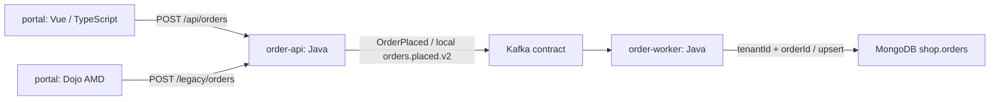

# LoreDock synthetic system corpus

Task 014 provides three deterministic Git repositories, reviewer-owned expectations
and a no-model feasibility probe. This is a static analysis corpus, not an application
to install or deploy. All inputs are synthetic; no corporate source or credentials are
included. Java 17/Maven, Vue script-setup and Dojo AMD are sample assumptions only.



The broker, database, transport implementations and deployment values are absent.
The flow describes source intent under local configuration, not observed runtime
behavior. The API README deliberately names an obsolete topic. Both Java components
accept an `ORDER_TOPIC` override; production equivalence cannot be inferred.

## Reproduce

Use the repository's pinned Node 22 toolchain and installed workspace dependencies.
Git and symlinks are required; L0 was verified on Linux. From the repository root:

```sh
pnpm build:packages
node scripts/loredock-fixture.mjs
node --test scripts/tests/loredock-fixtures.test.mjs
node scripts/loredock-feasibility.mjs
```

The generator prints a temporary root and leaves it available for inspection. Its
`sources/` directory contains three Git repositories; `manifest.json` and `oracle.json`
are siblings outside those repositories. Generated roots belong to this fixture and
may be removed after inspection. Tests and the feasibility probe remove their own
temporary roots automatically, including on failure. Nothing is installed or executed
from the generated repositories.

The optional `--executable /absolute/path/to/codex` argument on the feasibility probe
performs only `--version` with a temporary empty configuration home and a minimal
environment. It does not use an existing login or make a model request. Omitting the
argument never starts Codex. The probe requires built AI package output solely for
the existing process-supervision helper.

## Review and evaluation rules

- [Source templates](repos/) contain 18 admitted files. The generator adds nine excluded
  canaries: a synthetic `.env`, a binary file and an outside symlink per repository.
  A separate outside file tests future read isolation; its presence proves no boundary.
- [The baseline](baseline.json) freezes revisions, blob/content hashes and 1-based
  inclusive line ranges. Each span covers one small complete file. Fixed identities,
  timestamps, object format and isolated Git configuration make revisions reproducible.
  Corpus changes require an explicit baseline and oracle review; tests reject silent drift.
- [The oracle](oracle.mjs) defines 20 questions, acceptable answers, citations and required
  uncertainty, plus ten incident cases with required search repositories, maximum
  candidates and gaps. It was authored before any LoreDock model run. Never include
  the oracle, expected answers or evaluator files in model inputs or retrieval.
- In a future evaluation, freeze the corpus, oracle, model, prompt and retrieval settings
  before execution. Keep per-case results; do not change expected answers to fit output.
  Citation resolution, semantic support, completeness, environment scope and abstention
  are separate checks. Record retrieval failures separately from generation failures.
- For routing, report required-repository recall and false-positive candidates alongside
  the bound. An empty required set for r08 requires abstention and the missing billing
  source explanation, not a zero-effort success. Search scope is not a change instruction.
- `notes/source-instructions.txt` is adversarial fixture data. Its commands are never
  executed by the generator/probe. A parser rejecting an extra action field does not
  prove that a real model ignores malicious instructions.

The [recorded result](feasibility-result.json) contains mechanical measurements only;
there is no model quality or routing score yet. See [feasibility limits](../../docs/loredock/FEASIBILITY.md)
and [the proposed product contracts](../../docs/loredock/CONTRACTS.md).
